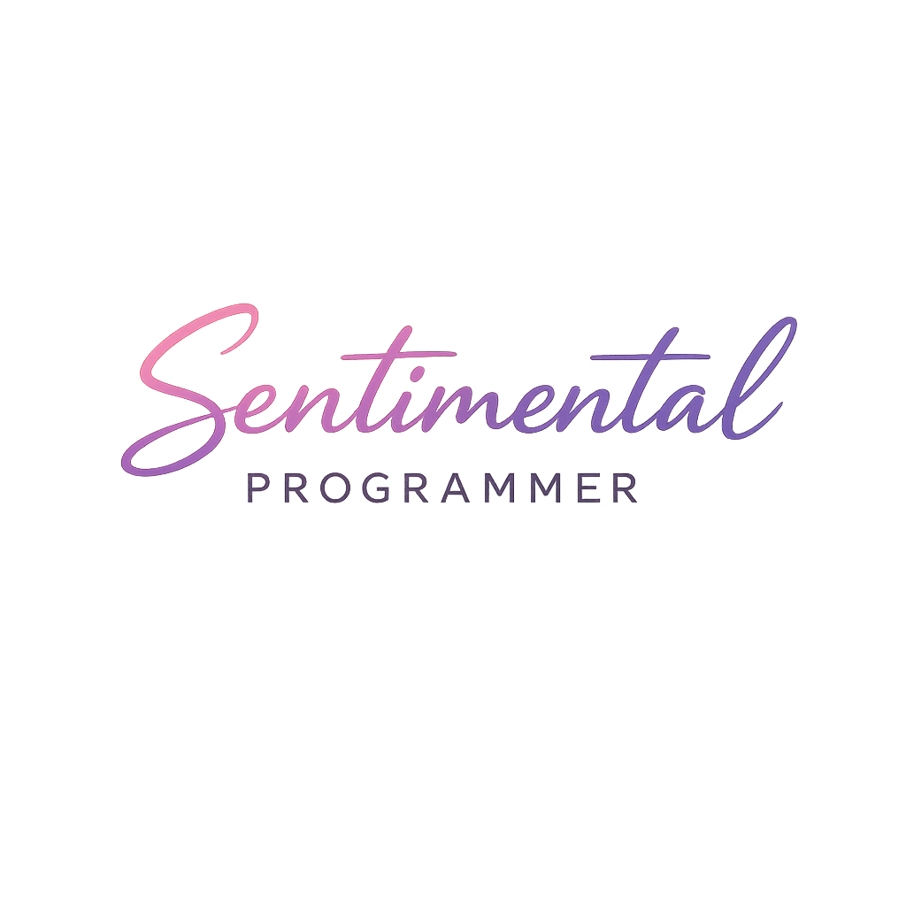
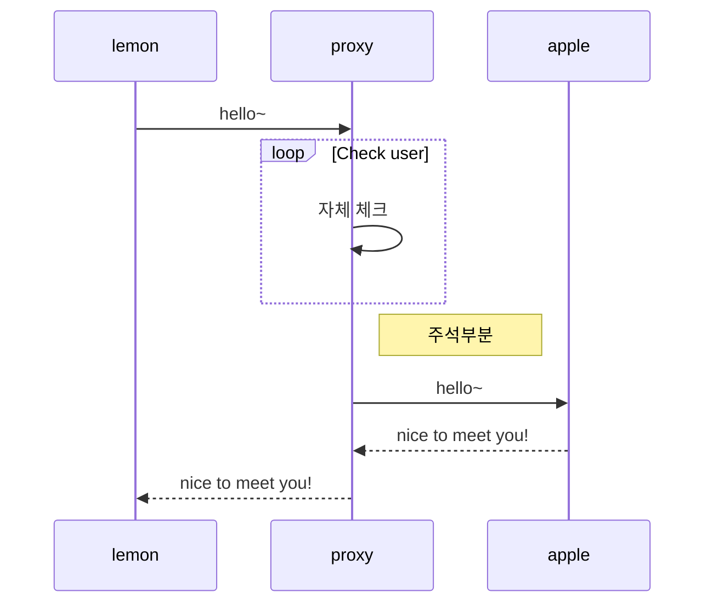

# 가장 큰 제목

초기 마크다운은 줄 끝 공백 2개( )만 지원함.\
공백 문자가 에디터의 자동 정제 기능(Trailing Whitespace Removal)이나
Git 버전 관리에서 문제를 일으키는 경우가 많아,\
마크다운의 국제 표준인 CommonMark 스펙(Section 6.7 Hard Line Breaks)에서\
줄 끝 백슬래시(\)를 공식적인 강제 줄바꿈 문법으로 명시했습니다.

## 두번째로 큰 제목

### 가장 작은 제목

- **볼드**
- _이탤릭_
- ~~취소선~~
- **볼드안에 _이탤릭_ 문자**

> 인용문구

```text
코드영역
```

```cpp
// 코드영역 시작시 cpp 명시하면 syntax highlight
#include <stdio.h>
void main() {
  printf("hello ysoftman~\n");
}
```

- 리스트1
- 리스트2

1. 순서리스트1
2. 순서리스트2

- [x] 해야할일1
- [ ] 해야할일2

| Tables | col1   | col2 |
| ------ | ------ | ---- |
| line1  | lemon  | 100  |
| line2  | apple  | 50   |
| line3  | banana | 30   |

\*\*백슬레시로 마크다운 문법 무시하기\*\*

<!--
url 은 angle brackets <> 로 감싸지 않으면 다음과 같은 경고가 난다.
MD034/no-bare-urls: Bare URL usedmarkdownlint(MD034)
-->

<https://www.google.com>

[구글링크](http://www.google.com)

```text

```


## 이모지(emoji) 사용

:+1: :smile:

## mermaid


